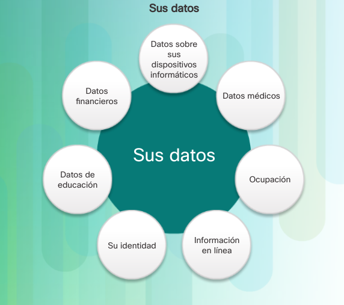

# Datos personales

**Índice**

[[_TOC_]]

## ¿Qué es la ciberseguridad?
Es el esfuerzo constante por proteger los sistemas informaticos y sus datos contra su uso
no autorizado.

_Se debe proteger.._

* **A nivel Personal:**
	* Identidad.
	* Datos
	* Dispositivos informáticos.
* **A nivel Corporativo;**
	* La reputación.
	* Los datos.
	* Clientes.
* **A nivel de estado:**
	* Seguridad nacional.
	* Seguridad y bienestar de los ciudadanos.

## Identidad en linea y fuera de linea
Entre más tiempo se pasa en linea su identidad en linea y fuera de, pueden afectar tu vida.

**Identidad fuera de linea**

La persona que eres con tus amigos, familiares, en el hogar, escuela o trabajo. Conocen tu información personal:
* Nombre, edad, dirección etc.

**Identidad en linea**

Como te presentas a otros en linea.
* Solo deberia revelar una cantidad limitada de información.

### Ninames
_No debe contener..._
* Información personal.
* Correcto y respetuoso.
No debe llevar a extaños a pensar que es un objetivo fácil para delitos ciberneticos o llamar
a atención no deseada.

## Datos
Cualquer información sobre used puede ser considerada como sus datos y puede identificarlo de
manera única como persona.

_estos datos incluyen_
* Imagenes.
* Mensajes que intercambia con amigos y conocidos en linea.
* Nombre.
* Número de seguro social.
* Fecha y lugar de nacimiento.
* Informaión médica, educativa, financiera y laboral.

	

